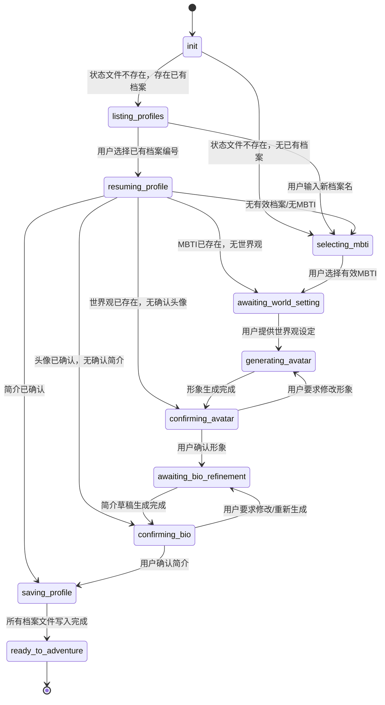

```mermaid
stateDiagram-v2
[*] --> init
init --> listing_profiles : 状态文件不存在，存在已有档案
init --> selecting_mbti : 状态文件不存在，无已有档案
listing_profiles --> resuming_profile : 用户选择已有档案编号
listing_profiles --> selecting_mbti : 用户输入新档案名
resuming_profile --> selecting_mbti : 无有效档案/无MBTI
resuming_profile --> awaiting_world_setting : MBTI已存在，无世界观
resuming_profile --> confirming_avatar : 世界观已存在，无确认头像
resuming_profile --> confirming_bio : 头像已确认，无确认简介
resuming_profile --> saving_profile : 简介已确认
selecting_mbti --> awaiting_world_setting : 用户选择有效MBTI
awaiting_world_setting --> generating_avatar : 用户提供世界观设定
generating_avatar --> confirming_avatar : 形象生成完成
confirming_avatar --> awaiting_bio_refinement : 用户确认形象
confirming_avatar --> generating_avatar : 用户要求修改形象
awaiting_bio_refinement --> confirming_bio : 简介草稿生成完成
confirming_bio --> saving_profile : 用户确认简介
confirming_bio --> awaiting_bio_refinement : 用户要求修改/重新生成
saving_profile --> ready_to_adventure : 所有档案文件写入完成
ready_to_adventure --> [*]
```